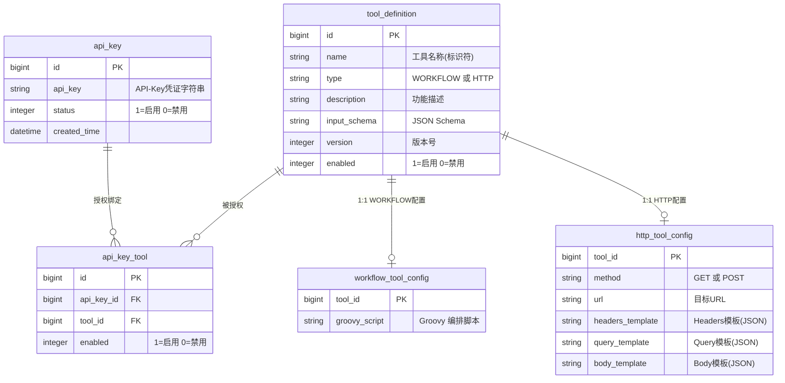
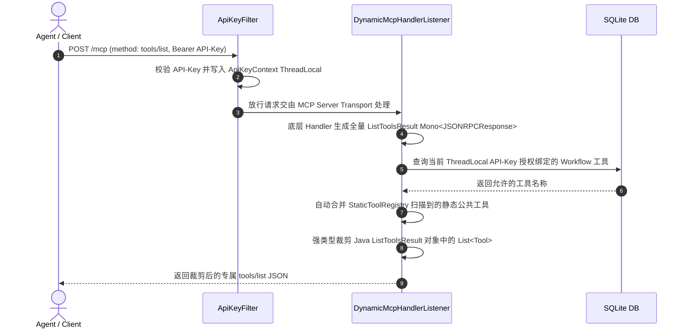
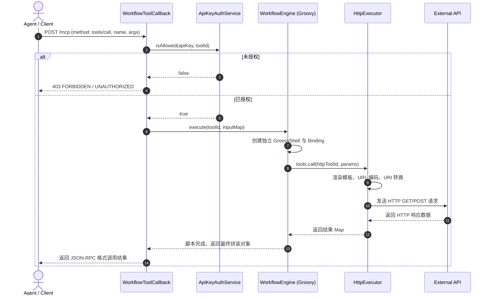

# Dynamic MCP Gateway - 基于 SDD (规范驱动开发) 的系统设计与架构文档

> **版本**：v1.1.0  
> **更新时间**：2026-07-27  
> **设计模式**：Spec-Driven Development (SDD)  
> **技术栈**：Java 17 / Spring Boot 3.4.7 / Spring AI 1.1.0 (MCP Server) / MyBatis-Plus / SQLite / Groovy 4.0 / Vanilla Web Console

---

## 1. 系统概述 (Overview)

### 1.1 业务背景与痛点
在 LLM (大语言模型) 架构中，**MCP (Model Context Protocol)** 规范已成为 Agent 连接外部能力的标准。传统 MCP 服务端通常将工具（Tools）硬编码在 Java/Python 源码中，每次新增、更新工具或修改 API 规则时，均需要重新编译部署，效率低下且无法针对不同的租户/客户端进行细粒度的工具授权隔离。

### 1.2 目标与核心能力
**Dynamic MCP Gateway** 是一个轻量级、高性能、基于 SQLite 与 Groovy 脚本引擎的动态 MCP 网关服务：
- **热插拔动态工具**：新增或调整工具配置存储于 SQLite，无需重启应用，即刻在线生效。
- **API-Key 级隔离与防护**：多租户 API-Key 授权机制，支持 `tools/list` 在 MCP 响应管道层动态强类型裁剪与 `tools/call` 阶段防止越权调用。
- **Groovy 工作流编排引擎**：使用 Groovy 脚本动态组装调用内部 HTTP 工具，支持复杂的参数转换、逻辑分支与结果拼接。
- **静态公共工具自动识别**：基于 Spring AI `@Tool` 注解与 `StaticToolRegistry` 自动扫描全局基础工具。
- **零依赖嵌入式 Web 控制台**：提供开箱即用的 Admin 可视化管理界面与标准 MCP 在线 Playground 调试控制台。

---

## 2. SDD 核心规范与架构设计 (Spec-Driven Architecture)

### 2.1 规范一：数据模型规格 (Data Model Spec)

系统基于 SQLite 数据库 (`./mcp-gateway.db`) 构建 5 张核心数据表：



### 2.2 规范二：MCP 协议规格 (MCP Protocol Spec)

本网关严格遵循 **MCP Streamable HTTP 协议规范 (2024-11-05)**：
1. **请求 Header 必须包含**：
   - `Authorization: Bearer <API-Key>`
   - `Accept: application/json, text/event-stream`
2. **生命周期握手时序**：
   - `initialize` (协商协议版本 `2024-11-05` 与客户端能力)
   - `notifications/initialized` (建立会话完成通知)
   - `tools/list` (拉取工具列表)
   - `tools/call` (执行特定工具调用)

### 2.3 规范三：安全与隔离分层架构 (Security & Isolation Layering)

遵循**单一职责原则 (SRP)** 与 **框架原生管道解耦设计**：

```
HTTP POST /mcp Request
   │
   ├── 1. ApiKeyFilter (继承 OncePerRequestFilter，纯粹充当身份上下文提供者)
   │     ├── shouldNotFilter(): 仅拦截 /mcp 路径
   │     ├── Authorization 提取 Bearer API-Key 并校验有效性
   │     ├── ApiKeyContext.set(apiKey): 写入 ThreadLocal 上下文
   │     └── filterChain.doFilter(): 放行请求（零 Response 修改与字节流拦截）
   │
   ├── 2. DynamicMcpHandlerListener (MCP 协议 Handler 层 Decorator 装饰器)
   │     ├── 在 ApplicationReadyEvent 时装饰底层 WebMvcStatelessServerTransport
   │     └── 在 Mono<JSONRPCResponse> 管道内拦截 tools/list：
   │           ├── 读取 ApiKeyContext.get() 上下文
   │           ├── 查库获取该 Key 授权的 Workflow 工具
   │           ├── 合并 StaticToolRegistry 自动扫描到的 @Tool 静态公共工具
   │           └── 强类型裁剪 Java ListToolsResult 对象中的 List<Tool>
   │
   └── 3. WorkflowToolCallback (tools/call 执行入口)
         └── ApiKeyAuthService.isAllowed(apiKey, toolId) 查校验防越权直调
```

### 2.4 规范四：双引擎运行时规格 (Runtime Engine Spec)

1. **WorkflowEngine (Groovy 编排引擎)**：
   - 每次执行创建独立的 `GroovyShell` 与 `Binding` 实例，杜绝线程间变量污染。
   - 注入上下文对象 `tools` (`ToolContext`)，脚本中通过 `tools.call(httpToolId, paramsMap)` 桥接调用底层 HTTP 工具。
2. **HttpExecutor (HTTP 执行引擎)**：
   - **User-Agent 自动注入**：默认注入标准 Chrome User-Agent，防止目标 WAF/CDN 拦截。
   - **智能占位符清理**：正则识别并自动剔除未传参的未替换占位符（如 `{{lang}}`），防止拼接出无效 Query 参数。
   - **URI 防二次编码**：将 URL 包装为 `java.net.URI` 对象后再传给 `RestTemplate`，防止 `%E5` 被二次转码为 `%25E5`。

---

## 3. 代码目录结构 (Directory Structure)

```text
com.zmm.mcp
├── McpGatewayApplication.java       // 应用启动类
├── admin                            // 后端 Restful CRUD 管理接口
│   ├── AdminApiKeyController.java   // API-Key 凭证接口
│   ├── AdminApiKeyToolController.java// 授权绑定关系接口
│   └── AdminToolController.java     // Tool 工具定义接口
├── auth                             // 安全认证与隔离层
│   ├── ApiKeyAuthService.java       // 工具调用越权校验服务
│   ├── ApiKeyContext.java           // ThreadLocal 上下文容器
│   └── ApiKeyFilter.java            // OncePerRequestFilter 极简身份认证过滤器
├── common                           // 通用 Result 返回对象与常量
├── config                           // 应用配置类 (AppConfig, RestTemplate 超时与 SSL 配置)
├── domain                           // 领域模型
│   ├── entity                       // MyBatis-Plus 实体类 (ApiKey, ToolDefinition 等)
│   └── mapper                       // Data Mappers (含 findWorkflowToolsByApiKey)
├── mcp                              // MCP 核心集成与 Handler 拦截层
│   ├── DynamicMcpHandlerListener.java// ApplicationReadyEvent Handler 动态装饰器
│   ├── DynamicToolCallbackProvider.java// 全量 WORKFLOW 工具注册器
│   ├── StaticToolConfig.java        // MethodToolCallbackProvider 配置
│   ├── StaticToolRegistry.java      // @Tool 静态公共工具自动扫描器
│   ├── StaticTools.java             // @Tool 静态工具实现 (时间获取/随机数生成)
│   └── WorkflowToolCallback.java    // Spring AI ToolCallback 适配器
├── runtime                          // 底层 HTTP 工具执行引擎
│   ├── HttpExecutor.java            // HTTP 请求渲染与发送器
│   ├── ToolInvoker.java             // 工具调用调度接口
│   └── ToolInvokerImpl.java         // 工具调用调度实现
└── workflow                         // Groovy 工作流引擎
    ├── ToolContext.java             // 注入 Groovy Binding 的 tools 代理
    ├── WorkflowEngine.java          // 工作流引擎接口
    └── WorkflowEngineImpl.java      // GroovyShell 评估器
```

---

## 4. 关键交互时序图 (Sequence Diagrams)

### 4.1 `tools/list` 动态隔离时序



### 4.2 `tools/call` 执行时序



---

## 5. Web 控制台架构 (Web Admin Console)

控制台采用 **Vanilla HTML5/CSS3/JS** 架构，零外部框架依赖，内置于 `src/main/resources/static/` 目录：

- **`index.html`**：响应式布局，包含 DashBoard Metrics、API-Key 列表、Tool 定义中心、动态授权勾选板与 MCP Playground 在线调试控制台。
- **`css/style.css`**：现代深色主题 (Dark Theme)，玻璃拟态 (Glassmorphism)，渐变高亮与圆角卡片设计。
- **`js/app.js`**：全功能 Fetch REST 交互，包含自动补全 `Accept: application/json, text/event-stream` 以及 **MCP 协议 3 步自动握手**控制器。

---

## 6. 快速开始与测试命令 (Quickstart)

### 6.1 启动应用
```bash
mvn spring-boot:run
```

### 6.2 访问 Web 控制台
浏览器访问：`http://localhost:8080/`

### 6.3 命令行 Curl 测试

**1. 初始化握手 (initialize)**：
```bash
curl -i -X POST http://localhost:8080/mcp \
  -H "Authorization: Bearer test-api-key-single" \
  -H "Content-Type: application/json" \
  -H "Accept: application/json, text/event-stream" \
  -d '{
    "jsonrpc": "2.0",
    "method": "initialize",
    "params": {
      "protocolVersion": "2024-11-05",
      "capabilities": {},
      "clientInfo": { "name": "mcp-test", "version": "1.0.0" }
    },
    "id": 1
  }'
```

**2. 查询工具列表 (tools/list)**：
```bash
curl -X POST http://localhost:8080/mcp \
  -H "Authorization: Bearer test-api-key-single" \
  -H "Content-Type: application/json" \
  -H "Accept: application/json, text/event-stream" \
  -d '{
    "jsonrpc": "2.0",
    "method": "tools/list",
    "id": 2
  }'
```

**3. 调用天气工具 (tools/call)**：
```bash
curl -X POST http://localhost:8080/mcp \
  -H "Authorization: Bearer test-api-key-single" \
  -H "Content-Type: application/json" \
  -H "Accept: application/json, text/event-stream" \
  -d '{
    "jsonrpc": "2.0",
    "method": "tools/call",
    "params": {
      "name": "get_weather",
      "arguments": { "city": "北京" }
    },
    "id": 3
  }'
```
